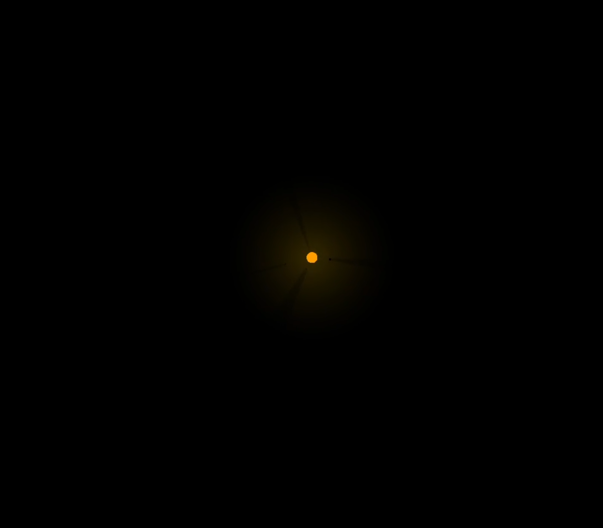

# Gravity Simulation

A small project for a creative coding class based on creating a realistic gravity simulation with audio listeners.

The simulation takes a sample audio and when ran will match the suns lumniosity with the volume and beats of the music.  Creating a unique reavealing affect of all the planets in orbit.

https://user-images.githubusercontent.com/59319360/207971091-a26cdcee-411e-47c3-a156-260b0ba278e3.mp4

## Some Screenshots

## Reflection

This was a 2 week long project built for the second project in my Creative Coding Course at the University of British Columbia. The project goals were to create an audio based simulation.

One of the main challenges I ran into was implementing the physics simulation, however, with the help of some youtube videos specifically from the amazing Sebastian Lague I was able to not only implement gravity physics but realistic gravity that is modeled after Newtonian law.

At the end of the day, I used the Unity Game Engine along with the C# coding langue to implemented in this project.  Furthermore, I was able to deepen my understanding about Newtonian physics, audio listeners and the Unity Game Engine.
